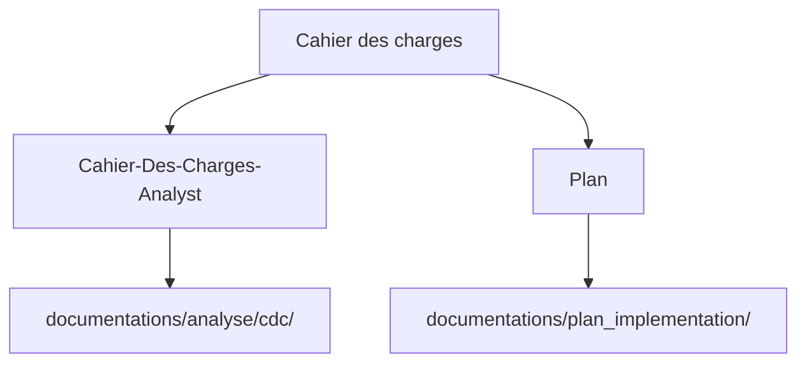
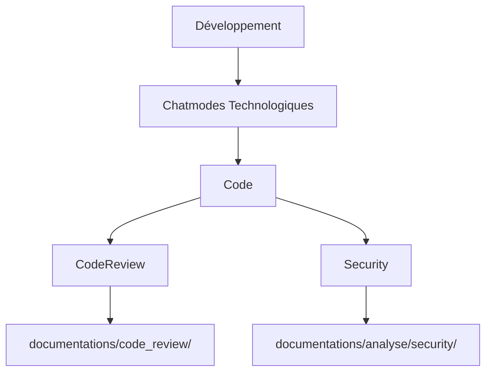
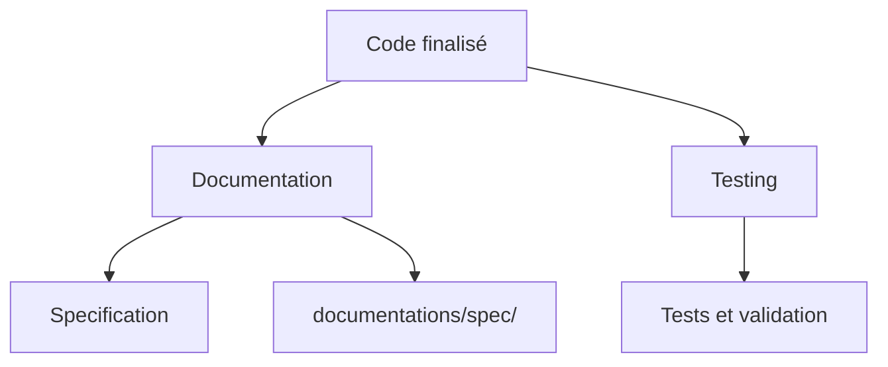

# Usine Logicielle - Collection de Chatmodes et Standards

> **🤖 Modèle Optimisé :** Claude Sonnet 4  
> Cette collection a été spécialement conçue et optimisée pour fonctionner avec Claude Sonnet 4, offrant des performances et une compréhension maximales.

Cette usine logicielle contient une collection complète de chatmodes et standards pour le développement logiciel. Chaque chatmode se concentre sur un aspect spécifique du cycle de développement et peut être utilisé indépendamment ou en combinaison avec d'autres.

## 📁 Structure du Projet

```
📂 UsineLogicielle/
├── 📂 .github/                    # Configuration et outils de développement
│   ├── 📂 chatmodes/              # Collection de chatmodes spécialisés
│   ├── 📂 instructions/           # Standards et bonnes pratiques
│   └── 📂 scripts/                # Scripts d'automatisation
├── 📂 documentations/             # Documentation générée par les chatmodes
│   ├── 📂 analyse/                # Analyses produites
│   │   ├── 📂 cdc/               # Analyses de cahiers des charges
│   │   └── 📂 security/          # Analyses de sécurité
│   ├── 📂 cahier_des_charges/    # Cahiers des charges sources
│   ├── 📂 code_review/           # Revues de code
│   ├── 📂 plan_implementation/   # Plans d'implémentation
│   └── 📂 spec/                  # Spécifications techniques
└── 📄 README.md                  # Ce fichier
```

## 🎯 Chatmodes Disponibles

### 🔄 Chatmodes Méthodologiques (10)

#### 📋 [Plan.chatmode.md](.github/chatmodes/Plan.chatmode.md)
**Objectif :** Génération de plans d'implémentation structurés pour les nouvelles fonctionnalités ou tâches de refactoring.
- **Destination :** `documentations/plan_implementation/`
- **Utilisation :** Planification, refactoring, analyse de requirements

#### 📋 [Cahier-Des-Charges-Analyst.chatmode.md](.github/chatmodes/Cahier-Des-Charges-Analyst.chatmode.md)
**Objectif :** Analyse critique et validation de cahiers des charges avec questionnement approfondi des besoins.
- **Source :** `documentations/cahier_des_charges/`
- **Destination :** `documentations/analyse/cdc/`
- **Utilisation :** Challenge systématique, validation de périmètres, affinage des besoins

#### 📋 [Specification.chatmode.md](.github/chatmodes/Specification.chatmode.md)
**Objectif :** Génération et mise à jour de documents de spécification pour les fonctionnalités nouvelles ou existantes.
- **Destination :** `documentations/spec/`
- **Utilisation :** Spécifications techniques, documentation d'architecture

#### 🐛 [Debug.chatmode.md](.github/chatmodes/Debug.chatmode.md)
**Objectif :** Debug et résolution systématique de problèmes dans le code.
- **Utilisation :** Investigation d'erreurs, diagnostic de performance

#### 🧪 [Testing.chatmode.md](.github/chatmodes/Testing.chatmode.md)
**Objectif :** Conception, implémentation et maintenance de suites de tests complètes.
- **Utilisation :** Stratégie de tests, tests unitaires et d'intégration

#### 👁️ [CodeReview.chatmode.md](.github/chatmodes/CodeReview.chatmode.md)
**Objectif :** Conduite de revues de code complètes axées sur la qualité, sécurité et meilleures pratiques.
- **Destination :** `documentations/code_review/`
- **Utilisation :** Revue de pull requests, analyse de qualité

#### 🔒 [Security.chatmode.md](.github/chatmodes/Security.chatmode.md)
**Objectif :** Analyse et implémentation de mesures de sécurité, identification de vulnérabilités.
- **Destination :** `documentations/analyse/security/`
- **Utilisation :** Audit de sécurité, conformité OWASP

#### 🔧 [Maintenance.chatmode.md](.github/chatmodes/Maintenance.chatmode.md)
**Objectif :** Maintenance, refactoring et modernisation de bases de code existantes.
- **Utilisation :** Réduction de dette technique, modernisation

#### 🛠️ [PPO.chatmode.md](.github/chatmodes/PPO.chatmode.md)
**Objectif :** Optimisation et refactoring du code en utilisant les meilleures pratiques (Performance, Patterns, Optimization).
- **Utilisation :** Optimisation des performances, design patterns

#### 📚 [Documentation.chatmode.md](.github/chatmodes/Documentation.chatmode.md)
**Objectif :** Création, mise à jour et maintenance de documentation complète pour les projets et fonctionnalités.
- **Utilisation :** Documentation d'API, guides utilisateur

### ⚙️ Chatmodes Technologiques (10)

#### Backend (7)
- **[Developpeur-Java.chatmode.md](.github/chatmodes/Developpeur-Java.chatmode.md)** - Java Enterprise et Spring
- **[Developpeur-Java-SpringBoot.chatmode.md](.github/chatmodes/Developpeur-Java-SpringBoot.chatmode.md)** - Spring Boot spécialisé
- **[Developpeur-Java-Quarkus.chatmode.md](.github/chatmodes/Developpeur-Java-Quarkus.chatmode.md)** - Quarkus cloud-native
- **[Developpeur-CSharp.chatmode.md](.github/chatmodes/Developpeur-CSharp.chatmode.md)** - C# et .NET moderne
- **[PHP-Expert.chatmode.md](.github/chatmodes/PHP-Expert.chatmode.md)** - Architecture PHP avancée
- **[Laravel-Expert.chatmode.md](.github/chatmodes/Laravel-Expert.chatmode.md)** - Framework Laravel
- **[Symfony-Expert.chatmode.md](.github/chatmodes/Symfony-Expert.chatmode.md)** - Framework Symfony enterprise

#### Frontend (2)
- **[Developpeur-React.chatmode.md](.github/chatmodes/Developpeur-React.chatmode.md)** - React moderne avec hooks
- **[Developpeur-Angular.chatmode.md](.github/chatmodes/Developpeur-Angular.chatmode.md)** - Angular avec TypeScript

#### API/Architecture (1)
- **[API-Expert.chatmode.md](.github/chatmodes/API-Expert.chatmode.md)** - APIs REST/GraphQL et microservices

## 📋 Instructions et Standards (9)

### 🔐 Sécurité et Conformité
- **[security-owasp.instructions.md](.github/instructions/security-owasp.instructions.md)** - Standards OWASP Top 10 2021
- **[pci-ssc.instructions.md](.github/instructions/pci-ssc.instructions.md)** - Conformité PCI-SSC
- **[rgaa-accessibility.instructions.md](.github/instructions/rgaa-accessibility.instructions.md)** - Accessibilité RGAA 4.1

### 🚀 Développement et Architecture
- **[api-standards.instructions.md](.github/instructions/api-standards.instructions.md)** - Standards de développement d'APIs
- **[dependency-manager.instructions.md](.github/instructions/dependency-manager.instructions.md)** - Gestion des dépendances
- **[java-spring-boot.instructions.md](.github/instructions/java-spring-boot.instructions.md)** - Développement Spring Boot

### 🐘 PHP et Frameworks
- **[php-standards.instructions.md](.github/instructions/php-standards.instructions.md)** - Standards PHP modernes
- **[laravel-standards.instructions.md](.github/instructions/laravel-standards.instructions.md)** - Bonnes pratiques Laravel
- **[symfony-standards.instructions.md](.github/instructions/symfony-standards.instructions.md)** - Standards Symfony enterprise

## 🔄 Workflow de Développement

### 1. Phase d'Analyse


### 2. Phase de Développement


### 3. Phase de Documentation


## 🎯 Comment Utiliser cette Usine Logicielle

### 1. Sélection du Chatmode
Choisissez le chatmode correspondant à votre objectif :
- **📋 Analyse de besoins** → `Cahier-Des-Charges-Analyst`
- **🎯 Planification** → `Plan`
- **⚙️ Développement** → Chatmodes technologiques (Java, React, PHP, etc.)
- **👁️ Qualité** → `CodeReview`
- **🔒 Sécurité** → `Security`
- **📚 Documentation** → `Documentation` ou `Specification`

### 2. Workflow Complet
```
1. Cahier des charges → Analyse critique → Plan d'implémentation
2. Développement avec chatmodes technologiques
3. Revue de code et analyse sécurité
4. Documentation et spécifications
5. Tests et validation
```

### 3. Structure Documentaire
Tous les livrables sont automatiquement organisés dans `documentations/` selon le type :
- **Sources** : `cahier_des_charges/`
- **Analyses** : `analyse/cdc/`, `analyse/security/`
- **Plans** : `plan_implementation/`
- **Revues** : `code_review/`
- **Spécifications** : `spec/`

## 🏗️ Architecture et Standards

### Respect des Standards
Tous les chatmodes intègrent automatiquement :
- **🔐 Sécurité OWASP** - Prévention des vulnérabilités Top 10
- **♿ Accessibilité RGAA** - Conformité aux standards d'accessibilité français
- **🛡️ PCI-SSC** - Traçabilité et protection des données sensibles
- **🏗️ Architecture** - Patterns et bonnes pratiques par technologie

### Technologies Supportées
- **Backend :** Java (Spring, Quarkus), PHP (Laravel, Symfony), C# (.NET)
- **Frontend :** React, Angular, TypeScript
- **Architecture :** APIs REST/GraphQL, Microservices, DDD, Cloud-Native
- **Bases de données :** Relationnelles, NoSQL, ORM/ODM
- **Infrastructure :** Cloud, Conteneurs, CI/CD

## 📊 Statistiques

**Total : 20 chatmodes** optimisés pour Claude Sonnet 4  
**Total : 9 fichiers d'instructions** pour les standards et bonnes pratiques

### Répartition
- **🔄 Méthodologiques :** 10 chatmodes
- **⚙️ Technologiques :** 10 chatmodes
- **📋 Instructions :** 9 standards
- **🗂️ Structure documentaire :** 6 dossiers organisés

## 🔧 Personnalisation et Extension

### Adaptation aux Projets
- **Chatmodes modulaires** : Utilisables indépendamment ou en combinaison
- **Standards évolutifs** : Instructions adaptables selon les besoins
- **Documentation structurée** : Organisation cohérente et traçable

### Évolution Continue
- **Feedback intégré** : Amélioration basée sur l'usage
- **Technologies émergentes** : Ajout de nouveaux chatmodes
- **Standards actualisés** : Mise à jour régulière des bonnes pratiques

## 🚀 Installation et Configuration

### Prérequis
- **VS Code** avec GitHub Copilot
- **Claude Sonnet 4** (recommandé)
- **Git** pour la gestion de version

### Utilisation
1. **Cloner le projet** dans votre workspace VS Code
2. **Sélectionner le chatmode** approprié à votre tâche
3. **Suivre le workflow** défini par le chatmode
4. **Consulter les instructions** de standards applicables
5. **Sauvegarder les livrables** dans la structure documentaire

---

## 📄 Support et Contribution

Cette usine logicielle est conçue pour évoluer avec les besoins des projets et les nouvelles pratiques de développement. N'hésitez pas à adapter, étendre et améliorer ces chatmodes selon vos besoins spécifiques.

**Dernière mise à jour :** 10 novembre 2025  
**Optimisé pour :** Claude Sonnet 4  
**Compatibilité :** VS Code + GitHub Copilot